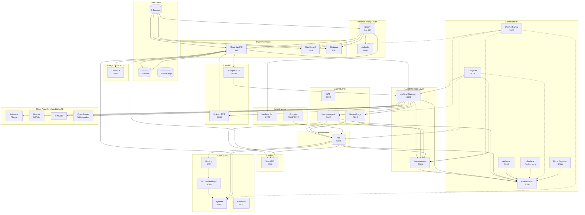

# Dream Server — Architecture Overview

## Layer Summary

| Layer | Services | Access |
|-------|----------|--------|
| User Interfaces | Open WebUI, Dashboard, Grafana | Via Caddy (+ Authelia) |
| LLM Gateway | LiteLLM (local + cloud routing) | Internal only |
| Agents | Hermes, DreamForge, APE | Internal / Bearer token |
| Voice I/O | Whisper, Kokoro | Via Open WebUI |
| Data & RAG | Qdrant, TEI, Docling, Baserow | Internal only |
| Automation | n8n | Via Authelia |
| Search | SearXNG | Internal only |
| Observability | Prometheus, Grafana, Langfuse, Uptime Kuma | Via Authelia |
| Infrastructure | Vaultwarden, Forgejo | Self-managed |
| Image Gen | ComfyUI | Internal only |
