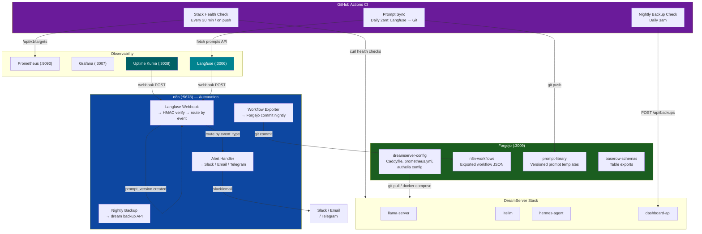
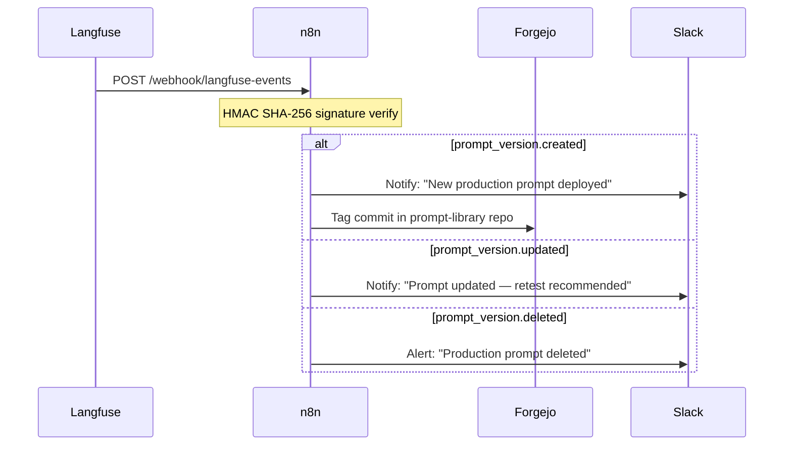
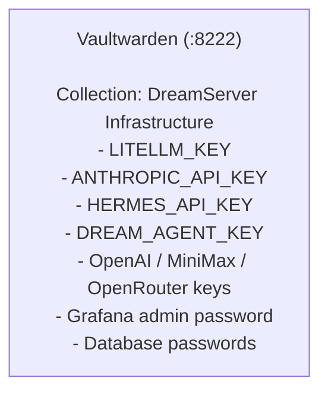

# Dream Server — GitOps & Automation Workflow

## Nightly GitOps Schedule

| Time | Job | What Happens |
|------|-----|-------------|
| 02:00 | Prompt sync | Langfuse → fetch production prompts → commit to `prompt-library` repo |
| 02:00 | Workflow export | n8n → export all workflows → commit to `n8n-workflows` repo |
| 03:00 | Backup check | Verify last backup age → alert if >25h → trigger new backup |
| Every 30min | Stack health | curl all service endpoints → alert if any fail |
| On push | Manifest validation | Validate all `manifest.yaml` schemas + compose syntax |

## Recommended Forgejo Repos

| Repo | Contents | Access |
|------|----------|--------|
| `dreamserver-config` | `.env.example`, Caddyfile, prometheus.yml, authelia config, alert rules | Shared team |
| `n8n-workflows` | Exported n8n workflow JSON files (nightly auto-commit) | Shared team |
| `hermes-agents` | Hermes agent configs, system prompts, tool definitions | Shared team |
| `prompt-library` | Versioned prompt templates synced with Langfuse | Shared team |
| `baserow-schemas` | Baserow table exports and API definitions | Shared team |
| `client-automations` | Per-client workflow configs (e.g. for agencies) | Private per repo |

## Langfuse Webhook → n8n Integration

## Secret Management — Vaultwarden

Vaultwarden collections for different teams/members — rotate keys quarterly, use org-level sharing to distribute credentials without plaintext `.env` spread across Slack/email.
