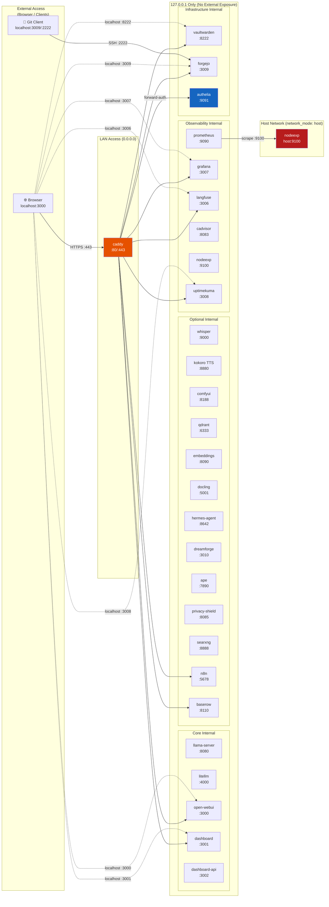

# Dream Server — Service Networking & Ports

## Port Reference

| Port | Service | Bind | Auth | Notes |
|------|---------|------|------|-------|
| `:80` / `:443` | Caddy | `0.0.0.0` | N/A | LAN entry point + HTTPS |
| `:2222` | Forgejo SSH | `127.0.0.1` | SSH key | Remote Git push via tunnel |
| `:3000` | Open WebUI | `127.0.0.1` | Authelia | Chat UI |
| `:3001` | Dashboard | `127.0.0.1` | Authelia | Control center |
| `:3006` | Langfuse | `127.0.0.1` | Authelia | LLM observability |
| `:3007` | Grafana | `127.0.0.1` | Authelia | Metrics dashboards |
| `:3008` | Uptime Kuma | `127.0.0.1` | Authelia | Status monitoring |
| `:3009` | Forgejo | `127.0.0.1` | Authelia | Self-hosted Git |
| `:3010` | DreamForge | `127.0.0.1` | Bearer token | Agent system |
| `:4000` | LiteLLM | `127.0.0.1` | LITELLM_KEY | Unified LLM gateway |
| `:5001` | Docling | `127.0.0.1` | Internal only | Document ingestion |
| `:5678` | n8n | `127.0.0.1` | Authelia | Workflow automation |
| `:6333` | Qdrant | `127.0.0.1` | Internal only | Vector database |
| `:8080` | llama-server | `127.0.0.1` | Internal only | LLM inference |
| `:8083` | cAdvisor | `127.0.0.1` | Internal only | Container metrics |
| `:8085` | Privacy Shield | `127.0.0.1` | Internal only | PII redaction |
| `:8090` | TEI Embeddings | `127.0.0.1` | Internal only | Text embeddings |
| `:8110` | Baserow | `127.0.0.1` | Authelia | No-code database |
| `:8188` | ComfyUI | `127.0.0.1` | Internal only | Image generation |
| `:8222` | Vaultwarden | `127.0.0.1` | Self-managed | Password manager |
| `:8642` | Hermes Agent | `127.0.0.1` | Bearer token | Autonomous agent |
| `:8880` | Kokoro TTS | `127.0.0.1` | Internal only | Voice synthesis |
| `:8888` | SearXNG | `127.0.0.1` | Internal only | Web search |
| `:9000` | Whisper | `127.0.0.1` | Internal only | Speech-to-text |
| `:9090` | Prometheus | `127.0.0.1` | Authelia | Metrics DB |
| `:9091` | Authelia | `0.0.0.0` | Public (login) | SSO provider |
| `:9100` | Node Exporter | **host** | Internal only | Host metrics (no Docker port) |

## Network Zones

| Zone | Services | External Access |
|------|----------|-----------------|
| **Public** | Caddy, Authelia (login page) | LAN + remote (via Tailscale/VPN) |
| **Authelia Protected** | Open WebUI, Dashboard, Grafana, Langfuse, n8n, Baserow, Forgejo, Uptime Kuma | Via Caddy + SSO |
| **Internal Only** | llama-server, litellm, Whisper, Kokoro, ComfyUI, Qdrant, TEI, Docling, Privacy Shield, SearXNG, cAdvisor, Prometheus | Docker network only |
| **Host Network** | Node Exporter | Host network (no Docker proxy) |
| **Self-Managed Auth** | Vaultwarden | Direct localhost access |
