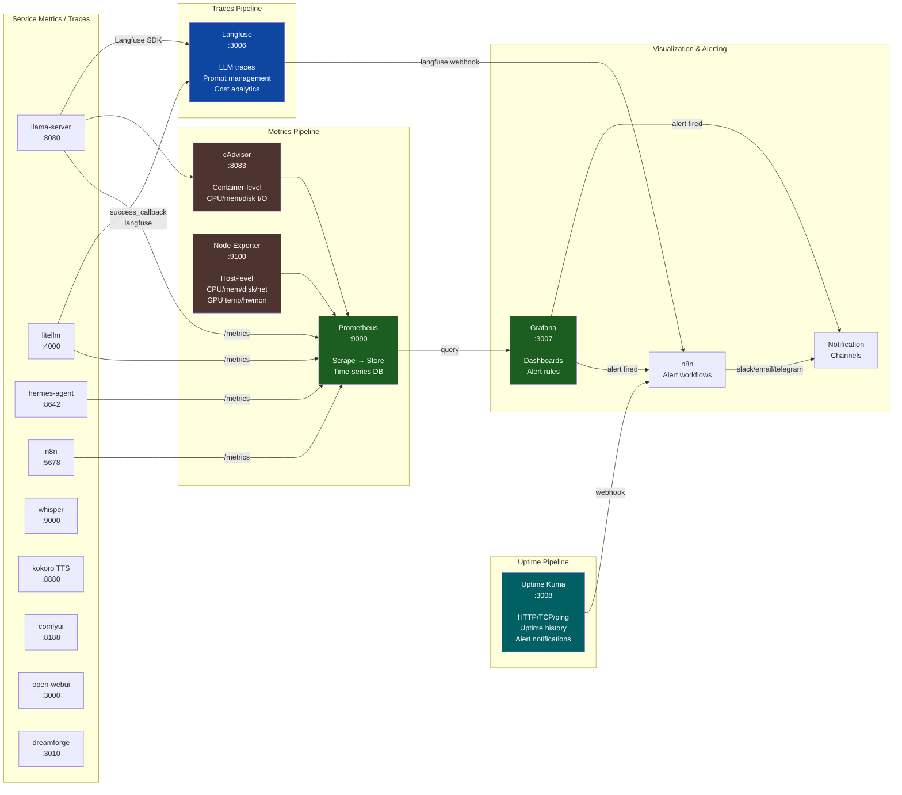

# Dream Server — Observability Stack

## Scrape Targets — Prometheus

| Target | Endpoint | Interval | Labels |
|--------|----------|----------|--------|
| llama-server | `llama-server:8080/metrics` | 30s | `job=dream-llama-server` |
| litellm | `litellm:4000/metrics` | 30s | `job=dream-litellm` |
| hermes-agent | `hermes-agent:8642/metrics` | 30s | `job=dream-hermes-agent` |
| n8n | `n8n:5678/metrics` | 30s | `job=dream-n8n` |
| cAdvisor | `cadvisor:8080/metrics` | 15s | `job=cadvisor` |
| Node Exporter | `host.docker.internal:9100` | 15s | `job=node-exporter` |
| Uptime Kuma | `uptime-kuma:3001/metrics` | 60s | `job=uptime-kuma` |
| Grafana | `grafana:3007/metrics` | 60s | `job=grafana` |

## Grafana Dashboards

| Dashboard | Source | Panels |
|-----------|--------|--------|
| LLM Observability | Prometheus | Request rate, error rate, p95 latency, token usage by model, container CPU/mem |
| cAdvisor Containers | Prometheus (cAdvisor) | Per-container CPU, memory, network I/O, disk I/O |
| Node Exporter Full | Prometheus (Node Exporter) | CPU, memory, disk, network, filesystem, loadavg, hwmon |
| Docker Monitoring | Prometheus (cAdvisor) | Container resource usage, network, filesystem |

## Alert Rules

| Alert | Condition | Severity | For |
|-------|-----------|----------|-----|
| LLM Server Down | `up{job="dream-llama-server"} == 0` | critical | 2m |
| GPU Memory > 90% | `container_memory_usage / container_spec_memory_limit > 0.9` | warning | 5m |
| Disk Usage > 90% | `node_filesystem_free / node_filesystem_size < 0.1` | warning | 5m |
