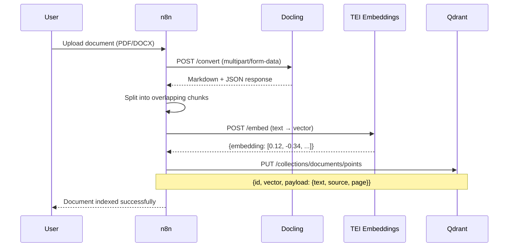

# Dream Server — RAG Pipeline

```mermaid
flowchart LR
    subgraph ingestion["Document Ingestion"]
        pdf["PDF\nAnnual Report"]
        docx["DOCX\nContract"]
        pptx["PPTX\nPresentation"]
        html["HTML\nWeb Page"]
        img["Image\nScanned Doc"]
    end

    subgraph preprocessing["Preprocessing"]
        docling["Docling\n:5001\n\nPDF/DOCX/PPTX/HTML/Image\n→ Clean Markdown\n+ Structured JSON\n+ Table extraction"]
    end

    subgraph chunking["Chunking"]
        chunks["Text Chunks\n(512-1024 tokens each)\n+ Overlap"]
    end

    subgraph embedding["Embedding Generation"]
        tei["TEI Embeddings\n:8090\n\ntext → vector\n1536 dimensions\nBAAI/bge-base-en-v1.5"]
    end

    subgraph storage["Vector Storage"]
        qdrant["Qdrant\n:6333\n\nCollection: documents\nVectors + Payload\n(metadata, text, source)"]
    end

    subgraph retrieval["Retrieval at Query Time"]
        query["User Query\n\"What did we decide\nabout the vendor\ncontract in March?\""]
        tei_query["TEI Embeddings\n(encode query)"]
        similarity["Top-K Similarity\nSearch\n(k=5)"]
        context["Retrieved Chunks\n(ordered by score)"]
    end

    subgraph synthesis["LLM Synthesis"]
        llm["LiteLLM / llama-server\n\nSystem: You are a helpful assistant.\nUser: [context chunks]\n[original query]"]
        answer["Answer with\ncited sources"]
    end

    ingestion --> docling
    docling --> chunks
    chunks --> tei
    tei --> qdrant

    query --> tei_query
    tei_query --> similarity
    qdrant --> similarity
    similarity --> context
    context --> llm
    llm --> answer

    style docling fill:#4a148c,color:#fff
    style tei fill:#0d47a1,color:#fff
    style qdrant fill:#1b5e20,color:#fff
    style llm fill:#e65100,color:#fff
```



## RAG Pipeline — n8n Automation



## Docling API Usage

```bash
# Health check
curl http://localhost:5001/health

# Convert a PDF
curl -X POST http://localhost:5001/convert \
  -F "file=@contract.pdf" \
  -F "output_format=markdown"

# Convert with JSON structure
curl -X POST http://localhost:5001/convert \
  -F "file=@report.pdf" \
  -F "output_format=json"
```

## Qdrant Collection Setup

```bash
# Create collection
curl -X PUT http://localhost:6333/collections/documents \
  -H "Content-Type: application/json" \
  -d '{
    "vectors": {
      "size": 768,
      "distance": "Cosine"
    }
  }'

# Search
curl -X POST http://localhost:6333/collections/documents/points/search \
  -H "Content-Type: application/json" \
  -d '{
    "vector": [0.12, -0.34, ...],
    "limit": 5,
    "with_payload": true
  }'
```
